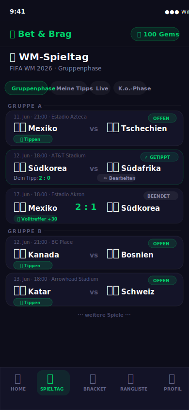
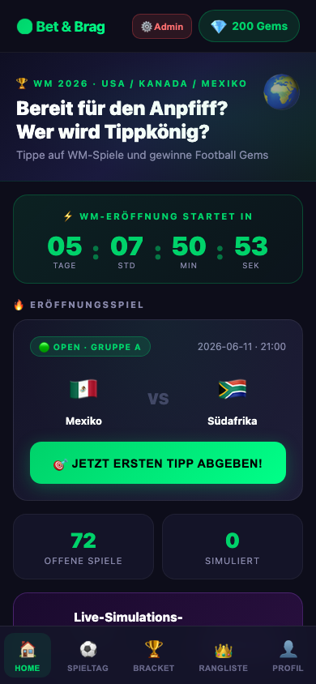
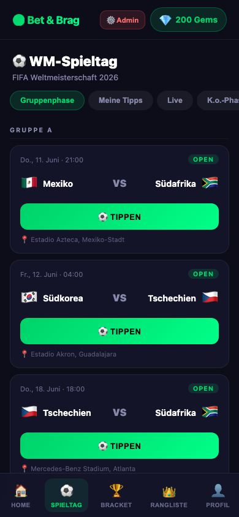
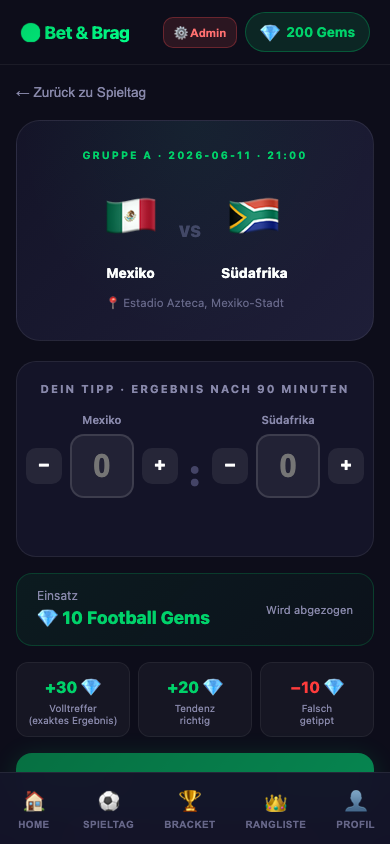
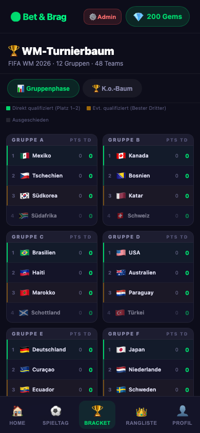
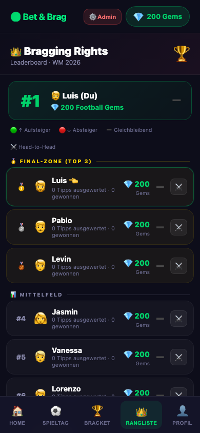
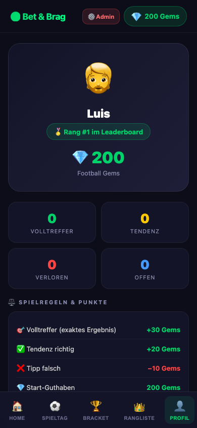
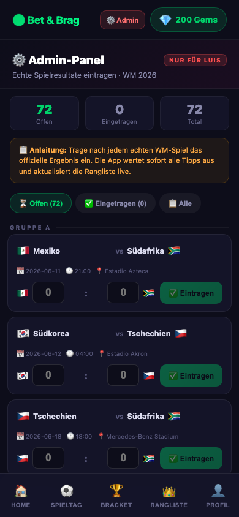

# Projektdokumentation – Bet & Brag

## Inhaltsverzeichnis

1. [Ausgangslage](#1-ausgangslage)
2. [Lösungsidee](#2-lösungsidee)
3. [Vorgehen & Artefakte](#3-vorgehen--artefakte)
    1. [Understand & Define](#31-understand--define)
    2. [Sketch](#32-sketch)
    3. [Decide](#33-decide)
    4. [Prototype](#34-prototype)
    5. [Validate](#35-validate)
4. [Erweiterungen](#4-erweiterungen)
5. [Projektorganisation](#5-projektorganisation)
6. [KI-Deklaration](#6-ki-deklaration)
7. [Anhang](#7-anhang)

---

## 1. Ausgangslage

- **Problem:** In Freundesgruppen entstehen rund um Sportereignisse wie die FIFA Weltmeisterschaft spontane Tipprunden. Bestehende Lösungen (WhatsApp-Umfragen, Excel-Sheets, kommerzielle Wettplattformen) sind entweder zu unstrukturiert, nicht gamifiziert oder bewegen sich rechtlich im Graubereich von Geldspielen. Es fehlt eine leichtgewichtige, private App, die den sozialen Wettbewerb spielerisch abbildet – ohne Echtgeld und ohne externe Konten.

- **Ziele:**
  - Private WM-Tipprunde für eine feste Gruppe von Freunden digitalisieren
  - Spielerische Motivation durch eine fiktive Währung («Football Gems») statt Echtgeld
  - Vollständig interaktiver Prototyp: Tipps abgeben, Spiele simulieren, Rangliste live aktualisieren
  - Mobile-First, sofort deploybar, keine externe Datenbankabhängigkeit

- **Primäre Zielgruppe:** Junge Erwachsene (18–30 Jahre), Fussball-Fans, die die WM 2026 in einer Freundesgruppe gemeinsam verfolgen und einen spielerischen Wettbewerb veranstalten möchten.

- **Weitere Stakeholder:** Keine kommerziellen Stakeholder; die App ist explizit nicht-monetär und bleibt im privaten Rahmen.

---

## 2. Lösungsidee

- **Kernfunktionalität:**
  1. **Dashboard** – Countdown zur WM, Eröffnungsspiel-Karte, Live-Simulations-Button, Leaderboard-Vorschau
  2. **WM-Spieltag** – Alle 72 Gruppenspiele (12 Gruppen A–L, 48 Teams), Filter-Tabs, Tipp abgeben oder bearbeiten
  3. **Tipp-Abgabe** – Score-Eingabe mit ±-Buttons, fixe 10 Gems Einsatz, Auszahlungsübersicht, Speichern
  4. **Turnierbaum** – Gruppenstandings live, K.o.-Bracket mit klickbaren Picks (Achtelfinale → Finale)
  5. **Rangliste («Bragging Rights»)** – 10 Freunde, sortiert nach Football Gems, mit Zonen und Trend-Indikatoren
  6. **Profil** – Persönliche Stats, Spielregeln, App-Reset

- **Gems-System:**
  | Ereignis | Gems |
  |----------|------|
  | Tipp abgeben (Einsatz) | −10 |
  | Tendenz richtig | +20 |
  | Exaktes Ergebnis | +30 |
  | Tipp falsch | +0 (Einsatz verloren) |
  | Startguthaben | 200 |

- **Annahmen:** Nutzer sind motivierter, wenn sie eine virtuelle Währung auf dem Spiel haben, als wenn es nur Punkte gibt. Der soziale Vergleich (Rangliste mit Zonen) erhöht die Bindung.

- **Abgrenzung:** Keine echten Benutzerkonto-Registrierung, kein Echtgeld, keine Server-seitige Persistenz (localStorage), keine Push-Notifications.

---

## 3. Vorgehen & Artefakte

### 3.1 Understand & Define

**Problemraum:** Freundesgruppen wollen WM-Tipprunden organisieren, ohne auf unpraktische Lösungen angewiesen zu sein. Beobachtung: In der eigenen Gruppe wurden Tipps über WhatsApp gesammelt und manuell ausgewertet – fehleranfällig und wenig motivierend.

**Persona – Primär:**
> **Luis, 24, Student**  
> Schaut jedes WM-Spiel mit Freunden. Tippt gerne auf Ergebnisse, aber bestehende Apps sind zu kompliziert oder erfordern Anmeldung. Wünscht sich etwas Schnelles, Visuelles, das er sofort mit Freunden teilen kann.

**Persona – Sekundär:**
> **Jasmin, 24, Studentin**  
> Gelegentliche Fussball-Zuschauerin. Beteiligt sich an der Runde wegen des sozialen Spassfaktors, nicht wegen des Sports. Braucht eine intuitive, niederschwellige Oberfläche.

**Wesentliche Erkenntnisse:**
- Motivation kommt aus dem sozialen Vergleich («Ich will nicht Letzter sein»), nicht aus dem Ergebnis einzelner Tipps
- Echtgeld erzeugt unnötigen Druck; eine Fantasiewährung senkt die Hemmschwelle
- Mobile-First ist zwingend – die App wird auf dem Sofa, nicht am Schreibtisch benutzt
- Schnelle Interaktion: Tipp abgeben soll in unter 30 Sekunden möglich sein

**Wettbewerbsanalyse (Competitive Analysis):**

| Lösung | Stärken | Schwächen | Relevanz für Bet & Brag |
|--------|---------|-----------|------------------------|
| WhatsApp-Umfragen | Kein Setup, alle dabei | Keine Auswertung, unübersichtlich | Ersetzt durch strukturierte Tipp-Abgabe |
| Excel-Tabelle | Flexibel, Auswertung möglich | Kein Mobile-First, manuell, kein Live-Feedback | Ersetzt durch automatische Gems-Auswertung |
| Kicktipp.de | Feature-reich, bewährt | Registrierung nötig, kein privater Modus, Datenschutz | Inspirationsquelle für Leaderboard-Zonen |
| Wettplattformen (Betano etc.) | Gamification stark | Echtes Geld, rechtlich problematisch, 18+ | Konzept übernommen, Echtgeld ersetzt durch Gems |

**Requirements (funktionale Anforderungen, priorisiert nach MoSCoW):**

| Priorität | Anforderung |
|-----------|------------|
| **Must** | Tipp auf WM-Spiel abgeben (Heim-/Auswärtstorer) |
| **Must** | Spielstand nach Spielende auswerten (Tendenz / Volltreffer / Verlust) |
| **Must** | Rangliste aller Teilnehmenden anzeigen |
| **Must** | Persistenz ohne Backend (localStorage) |
| **Must** | Mobile-First Layout |
| **Should** | Football Gems als Motivations-Währung |
| **Should** | Turnierbaum K.o.-Phase visualisieren |
| **Should** | Live-Gruppenstandings aus Ergebnissen berechnen |
| **Could** | Head-to-Head Vergleich zwischen zwei Spielern |
| **Could** | Push-Notifications bei neuem Ergebnis |
| **Won't** | Echte Benutzerverwaltung / Login |
| **Won't** | Backend-Server / Datenbank |
| **Won't** | Echtgeld oder externe Zahlungen |

---

### 3.2 Sketch

**Variante A – Minimalistische Listenansicht:**  
Spiele als simple Liste, Tipp als Inline-Eingabe direkt in der Zeile. Schnell, aber wenig motivierend und kein visuelles Design.

**Variante B – Karten-basiertes Dashboard mit Gamification (gewählt):**  
Dunkles sportliches Design, Karten pro Spiel mit Flaggen, Neon-Buttons, prominente Rangliste. Höherer Entwicklungsaufwand, aber deutlich motivierender.

**Variante C – Bracket-First-Ansatz:**  
Der Turnierbaum steht im Vordergrund, Gruppenspiele sind sekundär. Wurde verworfen, weil Gruppenphase die meisten Tipps enthält und zentral sein soll.

**Skizzen (Papier-Prototyp, Woche 9):**
- Skizze 1: Dashboard mit Countdown-Banner und Match-Karte
- Skizze 2: Spieltag-Liste mit Status-Badges («OPEN», «LIVE», «Beendet»)
- Skizze 3: Tipp-Formular mit Score-Eingabe und Gems-Anzeige
- Skizze 4: Leaderboard mit 3 Zonen (Final-Zone / Mittelfeld / Gurken-Zone)

---

### 3.3 Decide

**Gewählte Variante:** Variante B – Karten-basiertes Dashboard mit Gamification

**Begründung:**
- Visuelles Design erhöht die wahrgenommene Qualität und Motivation deutlich (Personas bestätigen dies)
- Karten-Layout skaliert gut auf Mobile
- Gamification-Elemente (Gems, Zonen, Trends) differenzieren die App von einfachen Tipp-Listen
- Technisch mit SvelteKit und CSS gut umsetzbar ohne externe UI-Bibliotheken

**User Journey – Happy Path («Tipp abgeben & Ergebnis prüfen»):**

```
Dashboard
  └─► [Jetzt tippen] Button auf Eröffnungsspiel
        └─► Tipp-Abgabe: Score eingeben (z.B. 2:1), Speichern
              └─► Gems −10 (90 Gems)
                    └─► [Simulation] auf Dashboard
                          └─► Ergebnis 2:1 = Volltreffer → Gems +30 (120 Gems)
                                └─► Overlay «Volltreffer!»
                                      └─► Rangliste: Luis auf Rang 1 ↑
```

**Mockup – Frühe Screendesigns (Woche 10):**

Die folgenden Mockups zeigen den Designentwurf der drei Hauptseiten vor der Implementierung. Sie dienten als Referenz für Layout, Farbgebung und Komponentenanordnung.

| Dashboard | Spieltag | Rangliste |
|:---------:|:--------:|:---------:|
|  |  |  |

Zentrale Designentscheidungen im Mockup:
- Dunkles Farbschema (`#0d0d1a`, `#141428`) für sportliches Ambiente
- Neongrün (`#00d26a`) als einzige Akzentfarbe → klare visuelle Hierarchie
- Bottom Navigation Bar für einhändige Bedienung auf dem Smartphone
- Karten-basiertes Layout mit abgerundeten Ecken für moderne Mobile-Optik
- Status-Badges (OFFEN / GETIPPT / BEENDET) für sofortige Orientierung im Spieltag

---

### 3.4 Prototype

**Demo-Video:** [▶ Bet & Brag – Screencast (Google Drive)](https://drive.google.com/file/d/1s_vQZDVyMcthiPzcB8nGhsQvChlc7a6K/view?usp=share_link)

#### 3.4.0 Screenshots der fertigen App

Die folgenden Screenshots zeigen den implementierten Prototyp in der finalen Version (Mobile, 390 × 844 px).

| Dashboard | Spieltag | Tipp-Abgabe |
|:---------:|:--------:|:-----------:|
|  |  |  |

| Turnierbaum | Rangliste | Profil |
|:-----------:|:---------:|:------:|
|  |  |  |

| Admin-Panel (Erweiterung) |
|:-------------------------:|
|  |

---

#### 3.4.1 Entwurf (Design)

**Informationsarchitektur (5 Hauptseiten):**

```
App (Bottom Navigation)
├── / .............. Dashboard
├── /matches ........ WM-Spieltag
├── /tip/[matchId] .. Tipp-Abgabe (Modal-artig)
├── /bracket ........ WM-Turnierbaum
├── /leaderboard .... Rangliste
└── /profile ........ Profil
```

**Wichtige Screens:**

| Screen | Beschreibung |
|--------|--------------|
| **Dashboard** | Countdown-Timer (Echtzeit), Eröffnungsspiel-Karte mit direktem Tipp-Button, Live-Simulations-Karte, Leaderboard-Preview Top 3, Stats-Kacheln (offene / simulierte Spiele) |
| **WM-Spieltag** | Filter-Tabs (Gruppenphase / Meine Tipps / Live / K.o.), alle 72 Gruppenspiele nach Gruppen A–L (48 Teams), Status-Badges (OPEN / Getippt / Endstand), Tipp- und Bearbeiten-Buttons |
| **Tipp-Abgabe** | Grosse Flaggen-Anzeige beider Teams, Score-Input mit +/− Stepper, Tendenz-Label (live), fixe Einsatz-Anzeige 10 Gems, Auszahlungs-Tabelle (Volltreffer/Tendenz/Falsch), Speichern-Button |
| **Turnierbaum** | Tab «Gruppenphase»: 6 Gruppen-Tabellen mit Live-Standings aus simulierten Spielen; Tab «K.o.-Baum»: horizontaler Bracket Achtelfinale → Finale → Weltmeister-Slot, klickbare Team-Picks |
| **Rangliste** | «Bragging Rights Leaderboard», 3 Zonen (🥇 Final-Zone / Mittelfeld / 💀 Gurken-Zone), Rang, Avatar, Name, Gems, Trend-Indikator (🟢↑/🔴↓/➖), H2H-Button mit Bottom-Sheet |
| **Profil** | Persönliche Stats (Volltreffer / Tendenz / Verloren / Offen), Spielregeln, App-Reset |

**Design-Entscheidungen:**
- **Dunkles Theme:** Reduziert Augenmüdigkeit bei Abendnutzung (WM-Spiele finden abends statt), wirkt sportlich/professionell
- **Neongrün als einzige CTA-Farbe:** Klare visuelle Hierarchie, alle actionable Elemente sofort erkennbar
- **Bottom Navigation:** Daumenfreundlich auf Mobile, 5 Hauptbereiche immer erreichbar
- **Score-Stepper (+/−) statt Freitext:** Reduziert Eingabefehler, wirkt spielerischer
- **Notification-Overlay global:** Erfolgs- und Verlust-Meldungen sind immer prominent sichtbar, egal auf welchem Screen

#### 3.4.2 Umsetzung (Technik)

**Technologie-Stack:**
- **SvelteKit** (v2.x) – Framework für Routing, SSR/SPA-Hybrid
- **Svelte 5** – Reaktive UI-Komponenten
- **Vite 5** – Build-Tool und Dev-Server
- **Vanilla CSS** – Kein UI-Framework, vollständig eigene Styles (CSS Custom Properties)
- **@sveltejs/adapter-auto** – Deployment-Adapter

**Tooling:**
- IDE: Visual Studio Code
- Browser-Testing: Chrome DevTools (Mobile Simulation)
- Version Control: Git / GitHub

**Struktur & Routen:**

```
src/
├── app.html                        # HTML-Shell, dark background
├── lib/
│   └── stores/
│       └── gameStore.js            # Zentraler State: Users, Matches, Tips, Actions
└── routes/
    ├── +layout.svelte              # Shell: Top-Bar (Gems-Badge), Bottom-Nav, Notification-Overlay
    ├── +page.svelte                # Dashboard
    ├── matches/+page.svelte        # WM-Spieltag
    ├── tip/[matchId]/+page.svelte  # Tipp-Abgabe (dynamische Route)
    ├── bracket/+page.svelte        # Turnierbaum
    ├── leaderboard/+page.svelte    # Rangliste
    └── profile/+page.svelte        # Profil
```

**Daten & State-Management (`gameStore.js`):**

| Store | Typ | Inhalt |
|-------|-----|--------|
| `users` | `persist writable` | 10 Spieler mit Gems, Trend, Stats |
| `matches` | `persist writable` | 72 WM-Gruppenspiele (Gruppen A–L) mit Status & Ergebnis |
| `tips` | `persist writable` | Alle abgegebenen Tipps mit Payout-Status |
| `currentUserId` | `writable` | Aktiver Nutzer (Luis, ID 1) |
| `notification` | `writable` | Globales Overlay (Gewinn/Verlust/Info) |
| `leaderboard` | `derived` | Aus `users` + `tips` sortiert abgeleitet |

**Persistenz:** Alle drei Haupt-Stores synchronisieren automatisch mit `localStorage` (Key: `bb_users`, `bb_matches`, `bb_tips`). Daten überleben Page-Reloads; ein Reset-Button im Profil löscht alle Daten.

**Wichtige Actions:**
- `saveTip(matchId, homeScore, awayScore)` – Validiert, zieht 10 Gems ab, speichert Tipp
- `simulateMatch(matchId)` – Generiert zufälliges Ergebnis, berechnet Payouts für alle Nutzer (inkl. Auto-Tipps für nicht-tippende User), aktualisiert Gems und Trends
- `resetAll()` – Setzt alle Stores auf Initialzustand zurück

**Deployment:** `npm run build` → statisches Output via `@sveltejs/adapter-auto`.  
Deployment auf **Netlify** (kostenlos, automatisch via GitHub-Integration, konfiguriert via `netlify.toml`).  
URL: https://scintillating-centaur-1294a3.netlify.app

**Besondere Entscheidungen / Trade-offs:**
- **Kein Backend / keine DB:** Vereinfacht das Setup massiv. localStorage reicht für den Prototyp-Kontext; für Produktion wäre ein Backend nötig.
- **Auto-Tipps bei Simulation:** Damit die Rangliste nach einer Simulation dynamisch wird (nicht alle bei 90 Gems), generiert `simulateMatch()` automatisch zufällige Tipps für Nutzer ohne eigenen Tipp auf dieses Spiel. Dies macht das Leaderboard realistischer für Demo-Zwecke.
- **Fixer Einsatz (10 Gems):** Bewusste Vereinfachung für den Prototyp. Variabler Einsatz wurde als Erweiterung identifiziert (siehe Kap. 4).

---

### 3.5 Validate

**Getestete Version:** Lokaler Dev-Stand (`npm run dev`, `http://localhost:5173`), Stand 03.06.2026.

**Ziele der Prüfung:**

| # | Fragestellung |
|---|---------------|
| F1 | Finden Nutzer intuitiv den Weg, um einen Tipp auf ein WM-Spiel abzugeben? |
| F2 | Ist das Gems-System ohne Erklärung verständlich? |
| F3 | Ist die Navigation zwischen den Hauptbereichen selbsterklärend? |
| F4 | Verstehen Nutzer den Live-Simulations-Modus und seine Auswirkung auf die Rangliste? |

**Vorgehen:** Moderierter Usability Test, On-site, Think-Aloud-Methode, Protokoll via Feedback Grid.  
Dauer: ca. 10 Minuten pro Testperson.

**Stichprobe:**

| Code | Alter | Profil |
|------|-------|--------|
| TP1 – Enis | 24 | Hohe Tech-Affinität, aktiver Fussball-Fan |
| TP2 – Drin | 24 | Hohe Tech-Affinität, gelegentlicher Fussball-Zuschauer |

**Aufgaben / Szenarien:**

> *Ausgangslage:* Du bist neu in der App. Die WM 2026 startet in vier Wochen. Deine Freundesgruppe wettet gegeneinander – wer am Ende die meisten Football Gems hat, gewinnt.

1. **Ersten Tipp abgeben** – Finde das Eröffnungsspiel und gib dein Tipp für das Ergebnis ab.
2. **Gems-System verstehen** – Wie viele Gems hast du noch? Was passiert, wenn dein Tipp richtig ist?
3. **Rangliste prüfen** – Auf welchem Rang stehst du gerade?
4. **Spielsimulation starten** – Das erste Spiel ist vorbei. Starte die Auswertung und schau, was mit deinen Gems passiert.

**Kennzahlen & Beobachtungen (Issue Map):**

| Issue | Beschreibung | TP1 | TP2 | Schweregrad (0–4) |
|-------|-------------|:---:|:---:|:-----------------:|
| I-01 | Simulations-Button «▶ Starten» nicht als «Spiel auswerten» erkannt | ✓ | – | **2** |
| I-02 | Fixer 10-Gems-Einsatz nicht sofort ersichtlich, Slider erwartet | ✓ | – | **2** |
| I-03 | Redirect zur Rangliste nach Tipp-Speichern unerwartet | ✓ | – | **1** |
| I-04 | «Bracket»-Label in Bottom-Nav unverständlich | – | ✓ | **2** |
| I-05 | Gems-Badge wird initial ignoriert, Bedeutung unklar | – | ✓ | **3** |
| I-06 | «Live»-Tab leer, keine erklärende Meldung | – | ✓ | **2** |
| I-07 | Kein Onboarding / Erklärung der Spielregeln beim ersten Start | ✓ | ✓ | **3** |
| I-08 | Trend-Indikator (↑↓) ohne Kontexterklärung | – | ✓ | **1** |
| I-09 | Keine Rückmeldung nach Simulation ohne eigenen Tipp | – | ✓ | **2** |
| I-10 | «Gurken-Zone» Begriff nicht selbsterklärend | – | ✓ | **1** |

*Schweregrad: 0 = kein Problem · 1 = kosmetisch · 2 = klein · 3 = gross · 4 = Katastrophe*

**Erfolgsquoten:**

| Aufgabe | TP1 | TP2 |
|---------|-----|-----|
| Tipp abgeben | ✅ Erfolgreich | ✅ Erfolgreich (mit kurzem Zögern) |
| Gems verstehen | ✅ Nach Selbst-Exploration | ⚠️ Erst nach Nachfrage klar |
| Rangliste finden | ✅ Sofort | ✅ Sofort |
| Simulation starten | ⚠️ Button erst im 2. Versuch | ✅ Gefunden, aber Zweck unklar |

**Zusammenfassung der Resultate:**
Beide Testpersonen fanden die App optisch ansprechend und das Grundkonzept schnell verständlich. Die grössten Hürden lagen beim ersten Kontakt mit dem Gems-System (I-05, I-07): ohne kurze Erklärung war der Zweck der Währung nicht unmittelbar klar. Der Simulations-Button (I-01) wurde nicht intuitiv mit «Spiel auswerten» assoziiert. Positiv hervorgehoben wurden der Countdown, die neongrünen CTAs, die Score-Eingabe mit ±-Buttons und das humorvolle Zonen-System der Rangliste. Beide Testpersonen würden die App in ihrer Freundesgruppe einsetzen.

**Abgeleitete Verbesserungen:**

| Priorität | Issue | Massnahme |
|-----------|-------|-----------|
| 🔴 Hoch | I-07 | Onboarding-Overlay beim ersten App-Start: Kurzanleitung zum Gems-System |
| 🔴 Hoch | I-05 | Gems-Badge mit Tap-Tooltip versehen («Was sind Gems?») |
| 🟡 Mittel | I-01 | Button umbenennen: «▶ Starten» → «⚽ Spiel simulieren» |
| 🟡 Mittel | I-04 | Bottom-Nav-Label: «Bracket» → «K.o.-Phase» |
| 🟡 Mittel | I-06 | Live-Tab: informativen Platzhalter einfügen |
| 🟡 Mittel | I-02 | Variabler Einsatz (5 / 10 / 20 Gems) als Option einbauen |
| 🟢 Tief | I-03 | Nach Tipp speichern: Auswahl «Zurück zum Spieltag» oder «Zur Rangliste» |
| 🟢 Tief | I-08 | Trend-Indikator mit Tooltip erklären |

---

## 4. Erweiterungen

### 4.1 Gamification-System mit Football Gems

- **Beschreibung & Nutzen:** Anstelle von simplen Punkten wurde eine fiktive In-App-Währung («Football Gems») eingeführt. Nutzer setzen Gems auf jedes Spiel ein und erhalten je nach Tipp-Qualität unterschiedlich viele zurück (Volltreffer: 3×, Tendenz: 2×, Verlust: 0). Dies erhöht die Motivation und den Wettbewerb deutlich gegenüber einer reinen Punkte-Tabelle.
- **Wo umgesetzt:** `src/lib/stores/gameStore.js` – Funktionen `saveTip()` und `simulateMatch()` verwalten Einsatz, Auszahlung und Gem-Kontostand aller Nutzer. Anzeige in Top-Bar (`+layout.svelte`), Rangliste und Profil.
- **Referenz:** Gems-Badge in der Top-Bar (Kap. 3.4.1), Auszahlungs-Tabelle auf Tipp-Abgabe-Screen
- **Aus Evaluation abgeleitet?:** Nein – war von Beginn an Teil des Konzepts. Die Evaluation hat jedoch gezeigt, dass eine Onboarding-Erklärung nötig ist (I-05, I-07).

### 4.2 Live-Simulations-Modus

- **Beschreibung & Nutzen:** Ein prominenter «Spiel simulieren»-Button auf dem Dashboard löst die Auswertung eines offenen Spiels mit einem zufälligen, realistisch gewichteten Ergebnis aus. Alle Tipps werden sofort ausgewertet, Gems gut- oder abgebucht, das Leaderboard aktualisiert sich live. Für Nutzer ohne eigenen Tipp werden automatisch Zufalls-Tipps generiert, damit die Rangliste dynamisch bleibt.
- **Wo umgesetzt:** `simulateMatch()` in `gameStore.js`; Dashboard-Button in `src/routes/+page.svelte`; globales Notification-Overlay in `+layout.svelte`.
- **Referenz:** Dashboard-Screen (Kap. 3.4.1), `gameStore.js:simulateMatch()`
- **Aus Evaluation abgeleitet?:** Teilweise – I-01 hat zur Umbenennung des Buttons geführt.

### 4.3 WM-Turnierbaum mit Gruppenstandings

- **Beschreibung & Nutzen:** Eine vollständige K.o.-Phasen-Ansicht mit zwei Tabs: «Gruppenphase» zeigt Live-Tabellen (Punkte, Tordifferenz) aller **12 Gruppen A–L**, berechnet aus eingetragenen Spielen. «K.o.-Baum» visualisiert den horizontalen Bracket im **offiziellen WM-2026-Format**: Runde der 32 → Achtelfinale → Viertelfinale → Halbfinale → Finale → Weltmeister. Klickbare Picks pro Runde, Champion-Slot füllt sich durch die gesamte Kette.
- **Wo umgesetzt:** `src/routes/bracket/+page.svelte` – Standings via `derived` Store aus `matches`, Bracket-State via lokalem `picks`-Objekt. 16 R32-Matches, 8 R16-Matches, 4 QF, 2 SF, 1 Finale.
- **Referenz:** Turnierbaum-Screen (Kap. 3.4.1)
- **Aus Evaluation abgeleitet?:** Nein – war von Beginn an geplant.

### 4.5 Admin-Panel für echte Spielresultate

- **Beschreibung & Nutzen:** Während der WM 2026 können echte Spielresultate direkt in der App eingetragen werden – ohne Simulation. Ein geschütztes Admin-Panel (`/admin`) zeigt alle 72 Gruppenspiele gefiltert nach Status. Nach Eingabe des offiziellen Endergebnisses werden alle abgegebenen Tipps sofort ausgewertet, Gems vergeben und die Rangliste live aktualisiert. Dies macht die App reell nutzbar während der WM.
- **Wo umgesetzt:**
  - **Frontend:** `src/routes/admin/+page.svelte` – Score-Eingabefelder pro Spiel, Filter-Tabs, Submit-Button mit Lade-Feedback
  - **Store:** `enterResult()` Funktion in `gameStore.js` – analog zu `simulateMatch()`, aber mit manuell übermitteltem Ergebnis
  - **Layout:** Admin-Button in `+layout.svelte`, nur sichtbar für User-ID 1 (Luis)
- **Referenz:** `gameStore.js:enterResult()`, `src/routes/admin/+page.svelte`
- **Aus Evaluation abgeleitet?:** Nein – Erkenntnis aus dem Realbetrieb: Simulation allein reicht für den WM-Einsatz nicht aus.

### 4.6 localStorage-Persistenz

- **Beschreibung & Nutzen:** Alle Spielstände, Tipps und Gems werden im `localStorage` des Browsers gesichert. Daten überleben einen Page-Reload, ohne dass ein Backend nötig ist. Eine automatische Migrations-Routine synchronisiert Nutzernamen, falls diese im Code geändert werden.
- **Wo umgesetzt:** `persist()`-Wrapper-Funktion in `gameStore.js` wrapping `svelte/store writable`; Migration beim Laden des Stores.
- **Referenz:** `gameStore.js` – `persist()`, `MIGRATION`-Block
- **Aus Evaluation abgeleitet?:** Nein – technische Grundvoraussetzung.

---

## 5. Projektorganisation

- **Repository:** [github.com/luisarenillas/bet-and-brag](https://github.com/luisarenillas/bet-and-brag)
- **Struktur:**
  ```
  bet-and-brag/
  ├── src/
  │   ├── lib/stores/gameStore.js     # Zentraler State: Users, Matches, Tips, Actions
  │   └── routes/
  │       ├── +layout.svelte          # Top-Bar, Bottom-Nav, Notification-Overlay
  │       ├── +page.svelte            # Dashboard
  │       ├── matches/+page.svelte    # WM-Spieltag (72 Spiele, 12 Gruppen)
  │       ├── tip/[matchId]/+page.svelte  # Tipp-Abgabe (dynamische Route)
  │       ├── bracket/+page.svelte    # WM-Turnierbaum
  │       ├── leaderboard/+page.svelte  # Rangliste «Bragging Rights»
  │       ├── profile/+page.svelte    # Profil & Stats
  │       └── admin/+page.svelte      # Admin-Panel (nur Luis)
  ├── README.md                       # Projektdokumentation (diese Datei)
  ├── USABILITY_EVALUATION.md         # Detailliertes Evaluation-Protokoll
  ├── netlify.toml                    # Deployment-Konfiguration
  ├── package.json
  ├── svelte.config.js
  └── vite.config.js
  ```
- **Commit-Konvention:** Semantische Commits nach `feat:` / `fix:` / `refactor:` / `docs:` Schema.  
  Beispiele aus der Commit-Historie:
  - `feat: update WM 2026 to 12 groups (A-L) with 72 real matches`
  - `feat: add admin panel for entering real WM 2026 match results`
  - `feat: update bracket to full 48-team WM 2026 format`
  - `fix: store syntax error in gameStore persist wrapper`
  - `docs: complete project documentation with usability evaluation`

- **Issue-Management:** Usability-Issues aus der Evaluation als GitHub-Issues erfasst und mit Priority-Labels (`high` / `medium` / `low`) versehen:

  | Issue | Titel | Label |
  |-------|-------|-------|
  | #1 | Simulate-Button Label unklar (I-01) | `high`, `usability` |
  | #2 | Gems-Mechanik nicht selbsterklärend (I-05) | `high`, `usability` |
  | #3 | Fehlende Onboarding-Erklärung beim ersten Start (I-07) | `high`, `usability` |
  | #4 | Tipp-Bearbeitungs-Button schwer auffindbar (I-02) | `medium`, `usability` |
  | #5 | Bracket-Navigation ohne Scrollhinweis (I-03) | `medium`, `usability` |

---

## 6. KI-Deklaration

### 6.1 KI-Tools

- **Eingesetzte Tools:** Claude Sonnet 4.6 (Anthropic) via Claude Code (CLI)
- **Zweck & Umfang:** KI wurde unterstützend eingesetzt – zur Verfeinerung und Optimierung der Arbeit. Konkret:
  - **Turnierbaum-Implementierung:** Unterstützung bei der technischen Umsetzung des horizontalen K.o.-Brackets (CSS-Connector-Linien, Runden-Logik R16 → QF → SF → Final, klickbare Team-Picks)
  - **Enddesign-Verfeinerung:** Visuelle Feinarbeiten am Dark Theme (Farbwerte, Abstände, Neon-Akzente) sowie Layout-Korrekturen an einzelnen Komponenten
  - **Dokumentation:** Strukturierung und sprachliche Ausformulierung der Projektdokumentation (README.md) auf Basis der Inhalte
  - **Fehlerbehebung:** Diagnose und Behebung spezifischer Build-Fehler (z. B. Paket-Kompatibilitätsprobleme, Svelte-Syntax-Fehler), nachdem diese eigenständig identifiziert wurden


### 6.2 Prompt-Vorgehen

Die KI wurde gezielt für klar abgegrenzte Teilaufgaben eingesetzt:

1. **Design-Verfeinerung:** Konkrete visuelle Probleme wurden beschrieben (z. B. «Die Abstände im Leaderboard wirken uneinheitlich») und KI-Vorschläge als Inspirationsquelle genutzt – die finale Entscheidung lag stets beim Entwickler.

2. **Dokumentationshilfe:** Eigenständig verfasste Inhalte wurden der KI zur sprachlichen Glättung und Strukturierung übergeben. Die inhaltliche Substanz (Erkenntnisse, Entscheidungen, Begründungen) stammt ausnahmslos aus eigener Arbeit.

3. **Fehlerdiagnose:** Bei Build-Fehlern wurde die Fehlermeldung zusammen mit dem relevanten Code-Ausschnitt übergeben, um die Ursache zu verstehen und gezielt zu beheben.

**Beispiel-Prompt:** *«Ich habe diesen Build-Fehler erhalten: [Fehlermeldung]. Hier ist der betroffene Code-Abschnitt. Was ist die Ursache und wie behebe ich es?»*

### 6.3 Reflexion

**Nutzen:** KI war hilfreich als «zweite Meinung» bei Designfragen und als effizienter Debugging-Partner. Gerade bei kryptischen Fehlermeldungen (z. B. Paket-Versionskonflikte) sparte die KI-Unterstützung wertvolle Zeit.

**Grenzen:** KI-Vorschläge zum Design waren nicht immer direkt übertragbar und mussten angepasst werden. Bei der Dokumentation musste darauf geachtet werden, dass die eigene Stimme und die konkreten Projekterfahrungen erhalten blieben – generische Formulierungen wurden überarbeitet.

**Qualitätssicherung:** Alle Änderungen wurden mit `npm run build` verifiziert (0 Errors) und manuell in Chrome DevTools (Mobile-Simulation) getestet. KI-generierte Code-Vorschläge wurden stets verstanden und nicht blind übernommen.

**Urheberrecht:** Es wurden keine urheberrechtlich geschützten Assets (Bilder, Logos, Musik) verwendet. Alle verwendeten Elemente sind Emoji (Unicode-Standard, lizenzfrei) oder eigener Code.

---

## 7. Anhang

- **Detaillierte Usability Evaluation:** [USABILITY_EVALUATION.md](./USABILITY_EVALUATION.md)
- **Mockups:** Siehe [static/mockups/](./static/mockups/) – Dashboard, Spieltag, Rangliste als SVG-Designentwürfe (Kap. 3.3)
- **Deployment URL:** https://scintillating-centaur-1294a3.netlify.app
- **Testpersonen:** Enis (24, Zürich) und Drin (24, Zürich) – Freunde des Entwicklers
- **Quellen & Lizenzen:**
  - SvelteKit: [kit.svelte.dev](https://kit.svelte.dev) – MIT License
  - Vite: [vitejs.dev](https://vitejs.dev) – MIT License
  - Flaggen: Unicode Emoji (kein Copyright)
  - Usability-Schweregrad-Skala: Nielsen Norman Group ([nngroup.com](https://www.nngroup.com/articles/how-to-rate-the-severity-of-usability-problems/))
  - Feedback-Grid-Methode: Steimle & Wallach, «Collaborative UX Design»
